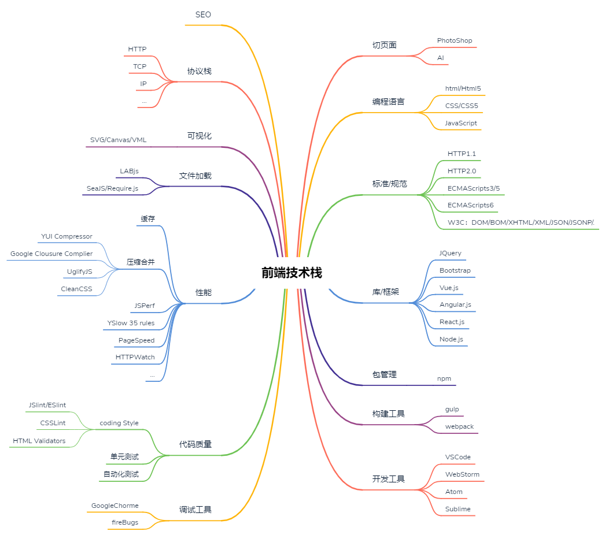

# 前端技术栈

## 目录
* 切页面
	* PhotoShop
	* AI
* 编程语言
	* html/Html5
	* CSS/CSS5
	* JavaScript
* 标准/规范
	* HTTP1.1
	* HTTP2.0
	* ECMAScripts3/5
	* ECMAScripts6
	* W3C：DOM/BOM/XHTML/XML/JSON/JSONP/.
* 库/框架
	* JQuery
	* Bootstrap
	* Vue.js
	* Angular.js
	* React.js
	* Node.js
* 包管理
	* npm
* 构建工具
	* gulp
	* webpack
* 开发工具
	* VSCode
	* WebStorm
	* Atom
	* Sublime
* 调试工具
	* GoogleChorme
	* fireBugs
* 代码质量
	* coding Style
	    * JSlint/ESlint
        * CSSLint
	    * HTML Validators
	* 单元测试
	* 自动化测试
* 性能
	* 缓存
	* 压缩合并
        * YUI Compressor
	    * Google Clousure Complier
	    * UglifyJS
        * CleanCSS
	* JSPerf
	* YSlow 35 rules
	* PageSpeed
	* HTTPWatch
	* ...
* 文件加载
	* LABjs
	* SeaJS/Require.js
* 可视化
	* SVG/Canvas/VML
* 协议栈
	* HTTP
	* TCP
	* IP
	* ...
* SEO

