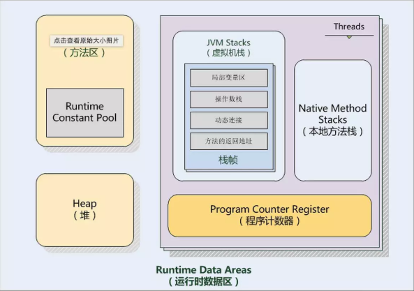

# Java技术梳理
>主要从实用性分析技术点的实际应用场景， 列举Java的主要技术点，基础类的自己自学理解。主要以问题的形式来展开分析。

## 目录
* Java基础 (自学)
* [`JVM`](#JVM)
* `数据结构`
* `IO流`
* `线程`
* `反射`
* `异常`

## JVM
1. JVM内存模型？<br>
	```
	堆 栈 方法区
	```
	
	
2. JVM调优
3. 系统运行缓慢，内存占用率高，如何分析定为原因？
