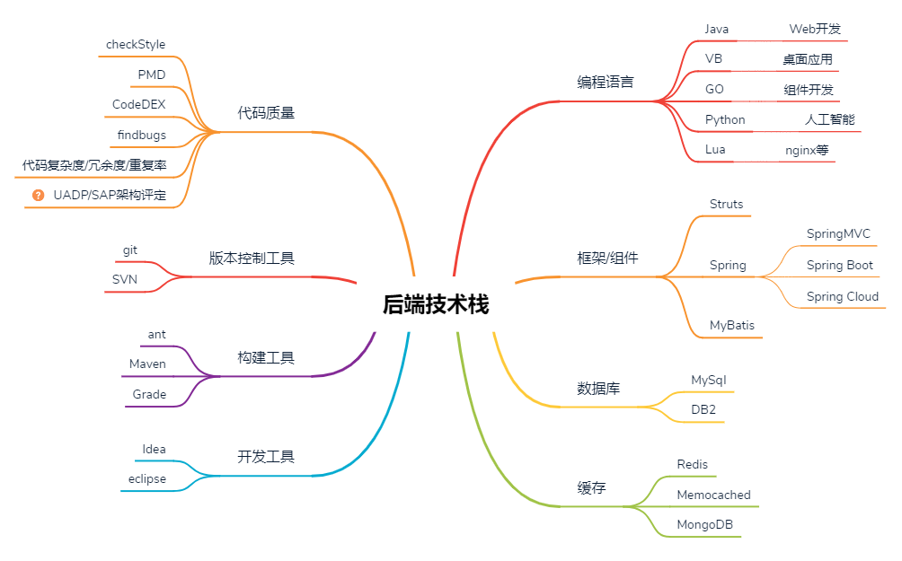

# 后端技术栈

## 目录
* 编程语言
 	* [Java](PGLanguages/Java/README.md)
 	* VB
 	* Go
 	* Python
 	* Lua
* 框架/组件
 	* Struts
 	* Spring
 	 	* SpringMVC
 	 	* Spring Boot
 	 	* Spring Cloud
 	* MyBatis
* 数据库
 	* MySql
 	* DB2
* 缓存
 	* Redis
 	* Memocached
 	* MongoDB
* 开发工具
 	* Idea
 	* eclipse
* 构建工具
 	* ant
 	* Maven
 	* Grade
* 版本控制工具
 	* git
 	* SVN
* 代码质量
 	* checkStyle
 	* PMD
 	* CodeDEX
 	* findbugs
 	* 代码复杂度/冗余度/重复率
 	* UADP/SAP架构评定
