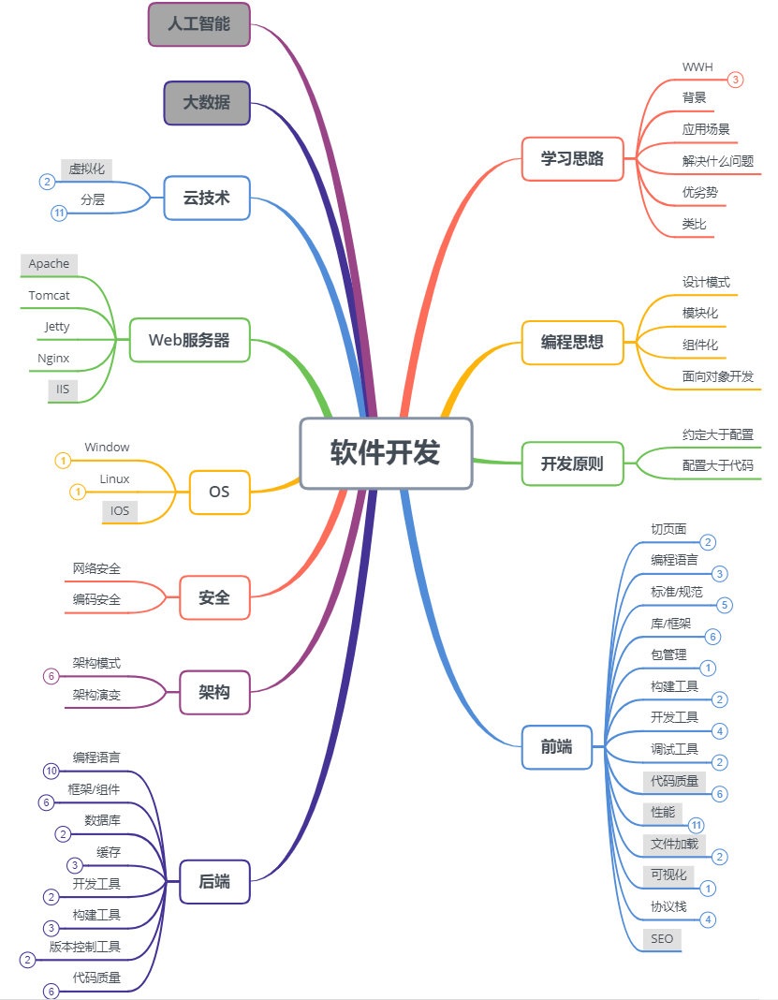

# 全栈总结[©](https://github.com/zhangyangbing)
本项目主要梳理总结以下几个维度的技术演进的背景和过程，以及对演进过程中可能遇到的问题，进行分析。 
>1.[技术栈梳理](#技术栈梳理)：前端，后端，开发工具，构建工具，安全，编码规范，框架，编程思想，性能，数据库，缓存，操作系统，云技术，大数据，人工智能等方面梳理。 
>2.[架构演进](#架构演进)：从单体项目到分布式->缓存->集群->SOA->微服务... 
>3.[框架演进](#框架演进)：从Servlet->Struts->SSH->SSM等... 

## 技术栈梳理

## 架构演进

## 框架演进

